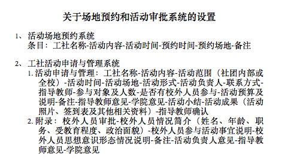

# Site Reservation and Project Approval

## 基础部分
1. 每个用户对应一种身份:超级管理员、管理员、教师、学生
2. 每个用户可以修改自身部分信息
3. 各系统操作均需要登录才可进行

## 场地预约系统

1. 预约处于以下任意一种状态，状态转换需相关人员操作:
	* 预约已提交: 完成预约表填写，等待相关负责人审核
	* 预约已取消: 申请人主动取消预约
	* 预约已批准: 负责人审核无误，同意该次预约
	* 预约修改中: 负责人审核不通过，修改后可重新进行提交审核
	* 预约已终止: 负责人审核不通过，直接终止本次预约操作，同时给出终止理由

2. 学生可以申请对某场地空闲时间段进行预约(最大时间段限制)，并在预约未批准前随时可以取消
3. 教师可对自身工坊学生申请的场地预约进行处理

## 活动审批系统
1. 活动审批处于以下任意一种状态，状态转换需相关人员操作:
	* 申请已提交: 完成活动申请表填写，等待相关负责人审核
	* 申请已取消: 申请人主动取消申请
	* 活动进行中: 负责人审核无误，同意该次活动，开始本次活动
	* 申请修改中: 负责人审核不通过，修改后可重新进行提交审核
	* 活动已终止: 负责人审核不通过，直接终止本次活动操作，同时给出终止理由
	* 结项待审核: 申请人完成活动，已提交相关附件供负责人审核
	* 结项修改中: 负责人审核不通过，给出修改意见由申请人进行审核
	* 活动已完成: 活动结项审核通过后被标记为正常完成，可进行正常报销操作
	* 活动已报销: 活动完成报销操作

2. 工坊学生需将相关活动照片、签到表、活动总结等资料作为附件上传

## TODOs:

### 基础部分

* 帐号邀请注册

### 场地预约系统

* 学生页面: Detail，如果有审批意见则显示审批意见
* 导出打印功能

### 活动审批系统

* 学生页面: Add，校外人员申请表
* 学生页面: Update，更新活动申请表内容，操作前检查预约状态
* 学生页面: Detail，详细展示指定申请表内容
* 指导教师页面: List，展示对应工坊所有活动申请表，按照处理状态排序
* 指导教师页面: Detail，详细展示指定申请表内容
* 指导教师页面: Update，完成申请表审核并给出反馈(可选)
* 导出打印功能

---
**文件说明:**

